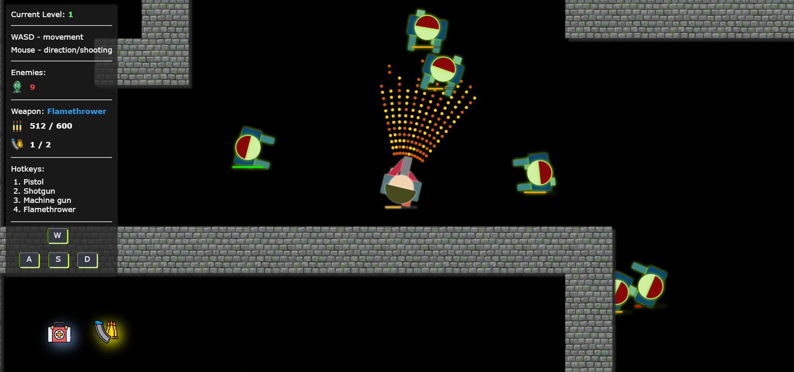

# Undead Bytes: Low-Poly Zombie Shooter

Welcome to Undead Bytes, a fun little low-poly shooter game written in vanilla JavaScript and powered by HTML5 canvas. Gear up, survive waves of zombies, and strategically use your weapons to navigate through each level. Are you ready to face the undead?

Want to contribute a map? Find out [how to here](./docs/CONTRIBUTE-MAPS.MD)!

## Table of Contents
- [Introduction](#introduction)
- [Features](#features)
- [Gameplay](#gameplay)
  - [Objective](#objective)
  - [Weapons](#weapons)
  - [Strategy](#strategy)
- [Contributing](#contributing)
- [License](#license)

## Introduction

Undead Bytes is a fun low-poly game where players engage in strategic zombie battles. With careful planning and strategic use of weapons, players must navigate through levels, conserving ammo and choosing the right tools for the job.

## Features

- **Varied Weapons:** Choose from a selection of weapons, each with its own strengths and weaknesses.
- **Strategic Gameplay:** Plan your moves, conserve ammo, and use the right weapon for the situation.
- **Engaging Levels:** Encounter different challenges as you progress through each level.

## Gameplay

### Objective

Your goal is to survive through each level by eliminating all the zombies. Watch your ammo, plan your moves, and stay alive!

### Weapons

1. **Pistol:** Suitable for dealing with single zombies at a distance.
2. **Shotgun:** Suitable for dealing with multiple zombies at close range.
2. **Machine Gun:** Suitable for engaging groups of zombies at close to medium range.
2. **Flamethrower:** Use this when surrounded by multiple zombies for effective spread damage.

### Strategy

- **Ammo Conservation:** Be mindful of your ammo. Reload strategically and consider switching weapons based on the situation.
- **Weapon Selection:** Use the pistol for distant enemies and the flamethrower for close-quarters combat.
- **Environmental Awareness:** Pay attention to your surroundings. Plan your movements to avoid getting overwhelmed.

## Contributing

Contributions are welcome! Whether you find a bug, want to add features, or improve the documentation, feel free to contribute.

1. Fork the project.
2. Create your feature branch: `git checkout -b feature/new-feature`.
3. Commit your changes: `git commit -m 'Add a new feature'`.
4. Push to the branch: `git push origin feature/new-feature`.
5. Open a pull request.

## License

This project is licensed under the [MIT License](LICENSE.md).

---

Dive into the world of Undead Bytes and see if you have what it takes to survive the low-poly undead onslaught. Happy gaming! 🧟‍♂️🔫
